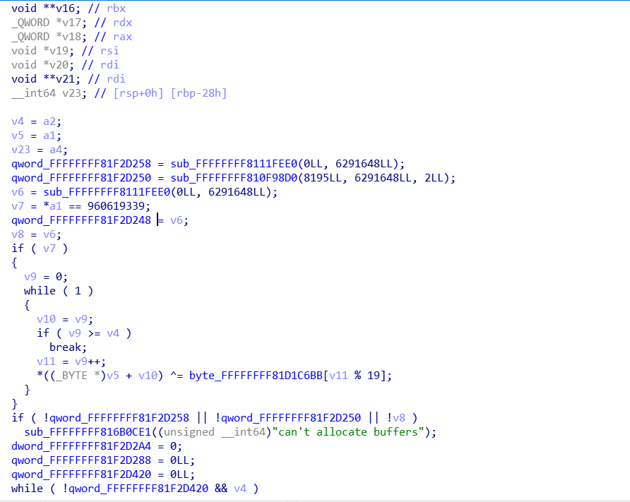

## Funny_misc

This hard disk has 2 partitions, the first partition is unencrypted, and the second partition is luks encrypted

We can see some kernel boot parameters and ramdisk through `grub.cfg`

```
set default="0"
set timeout="5"

menuentry "Buildroot" {
        linux /boot/bzImage root=/dev/sda2 rootwait console=tty1
        initrd /boot/encrypted_initrd.bin
}
```

But this ramdisk is encrypted, so we need to reverse the linux kernel image to decrypt the ramdisk

```
# file encrypted_initrd.bin 
encrypted_initrd.bin: data

```

The encryption logic of the memory disk, very simple encryption



decrypt

```c
#include <string.h>
#include <stdio.h>
#include <stdlib.h>

char *ReadFile(char *path, int *length, char *out);

int main()
{
    char *buf = (char *)malloc(1024 * 1024 * 50);
    int len;
    ReadFile("./encrypted_initrd.bin", &len, buf);

    char *secret = "ThI1s_IssSs_KkeEeyy";
    int secret_len=strlen(secret);

    for (size_t i = 0; i < len; i++)
    {
        buf[i] = buf[i] ^ secret[i%secret_len];
    }

    FILE *fp = NULL;
    fp = fopen("./decrypted_initrd.bin", "wb");
    for (size_t i = 0; i < len; i++)
    {
        fputc(buf[i], fp);
    }
    fclose(fp);
}

char *ReadFile(char *path, int *length, char *out)
{
    FILE *pfile;
    char *data;

    pfile = fopen(path, "rb");
    if (pfile == NULL)
    {
        return NULL;
    }
    fseek(pfile, 0, SEEK_END);
    *length = ftell(pfile);
    printf("length: %d\n", *length);
    data = (char *)malloc((*length + 1) * sizeof(char));
    rewind(pfile);
    *length = fread(data, 1, *length, pfile);
    data[*length] = '\0';
    fclose(pfile);
    memcpy(out, data, *length);
    return data;
}
```

After decryption, we can get the files in the ramdisk

```sh
└─# ls -al
total 80
drwxr-xr-x 18 root root 4096 Nov 16 22:20 .
drwxr-xr-x  7 root root 4096 Nov 16 23:34 ..
drwxr-xr-x  2 root root 4096 Nov 16 21:35 bin
drwxr-xr-x  3 root root 4096 Nov 16 21:35 boot
drwxr-xr-x  4 root root 4096 Nov 16 21:35 dev
drwxr-xr-x 10 root root 4096 Nov 16 21:35 etc
-rwxr-xr-x  1 root root  890 Nov 16 21:35 init
-rw-r--r--  1 root root 4096 Nov 16 21:35 keyfile
drwxr-xr-x  5 root root 4096 Nov 16 21:35 lib
lrwxrwxrwx  1 root root    3 Nov 16 21:35 lib64 -> lib
lrwxrwxrwx  1 root root   11 Nov 16 21:35 linuxrc -> bin/busybox
drwxr-xr-x  2 root root 4096 Nov 16 21:35 media
drwxr-xr-x  2 root root 4096 Nov 16 21:35 mnt
drwxr-xr-x  2 root root 4096 Nov 16 21:35 opt
drwxr-xr-x  2 root root 4096 Nov 16 21:35 proc
drwx------  2 root root 4096 Nov 16 21:35 root
drwxr-xr-x  3 root root 4096 Nov 16 21:35 run
drwxr-xr-x  2 root root 4096 Nov 16 21:35 sbin
drwxr-xr-x  2 root root 4096 Nov 16 21:35 sys
drwxrwxrwt  2 root root 4096 Nov 16 21:35 tmp
drwxr-xr-x  7 root root 4096 Nov 16 21:35 usr
drwxr-xr-x  4 root root 4096 Nov 16 21:35 var
```

Through the init file, we can see that the keyfile is the encryption key for partition two

```shell
#!/bin/sh
# devtmpfs does not get automounted for initramfs
/bin/mount -t devtmpfs devtmpfs /dev

# use the /dev/console device node from devtmpfs if possible to not
# confuse glibc's ttyname_r().
# This may fail (E.G. booted with console=), and errors from exec will
# terminate the shell, so use a subshell for the test
if (exec 0</dev/console) 2>/dev/null; then
    exec 0</dev/console
    exec 1>/dev/console
    exec 2>/dev/console
fi

mkdir -p /proc /sys
mount -t proc proc /proc
mount -t sysfs sysfs /sys
mkdir -p /dev/pts
mount -t devpts devpts /dev/pts
echo /bin/mdev > /proc/sys/kernel/hotplug
mdev -s
mkdir -p /mnt/rootfs

cryptsetup luksOpen --key-file /keyfile /dev/sda2 rootfs
mount /dev/mapper/rootfs /mnt/rootfs
cd /mnt/rootfs
mount --move /sys sys
mount --move /proc proc
mount --move /dev dev
exec switch_root -c /dev/console /mnt/rootfs /sbin/init

#exec /sbin/init "$@"

```

Decrypt and mount partition two to see the flag

```
┌──(root💀kali)-[~/Desktop/n1ctf2021]
└─# cryptsetup luksOpen --key-file ./keyfile /dev/sda2 rootfs
                                                    
┌──(root💀kali)-[~/Desktop/n1ctf2021]
└─# mkdir rootfs1                   

┌──(root💀kali)-[~/Desktop/n1ctf2021]
└─# mount /dev/mapper/rootfs rootfs1
                                                                         
┌──(root💀kali)-[~/Desktop/n1ctf2021/rootfs1]
└─# ls
bin  boot  dev  etc  flag.png  lib  lib64  linuxrc  lost+found  media  mnt  opt  proc  root  run  sbin  sys  tmp  usr  var
```


